# IT Asset Management System

[](https://www.python.org/)
[](https://www.djangoproject.com/)
[](https://reactjs.org/)
[](https://www.postgresql.org/)
[](https://www.django-rest-framework.org/)
[](http://182.48.94.12:3000/login)

> ⚠️ **This is a public showcase repository.** The source code is private as this is a production system deployed at [Feni Diabetes Hospital](https://fenidiabetic.org/). This README documents the project for portfolio purposes.

---

## 📌 Overview

**IT Asset Management System** is a production-grade, full-stack web application built for **Feni Diabetes Hospital, Feni, Bangladesh** to manage its entire IT asset lifecycle — from acquisition and tracking to repair, transfer, and retirement.

It features a **Text-to-SQL AI Agent** powered by Groq LLM, enabling non-technical hospital staff to query the asset database using plain natural language — no SQL knowledge required.

---

## 🚀 Live Demo

> **URL:** [http://182.48.94.12:3000/login](http://182.48.94.12:3000/login)  
> Self-hosted on Ubuntu VPS · Nginx · Gunicorn · AAPanel  
> ⚠️ Hosted on a private VPS — if unavailable, the server may be temporarily offline.

---

## 📸 Screenshots

### Dashboard & AI Agent
| Dashboard | AI Agent (Text-to-SQL) |
|-----------|------------------------|
| 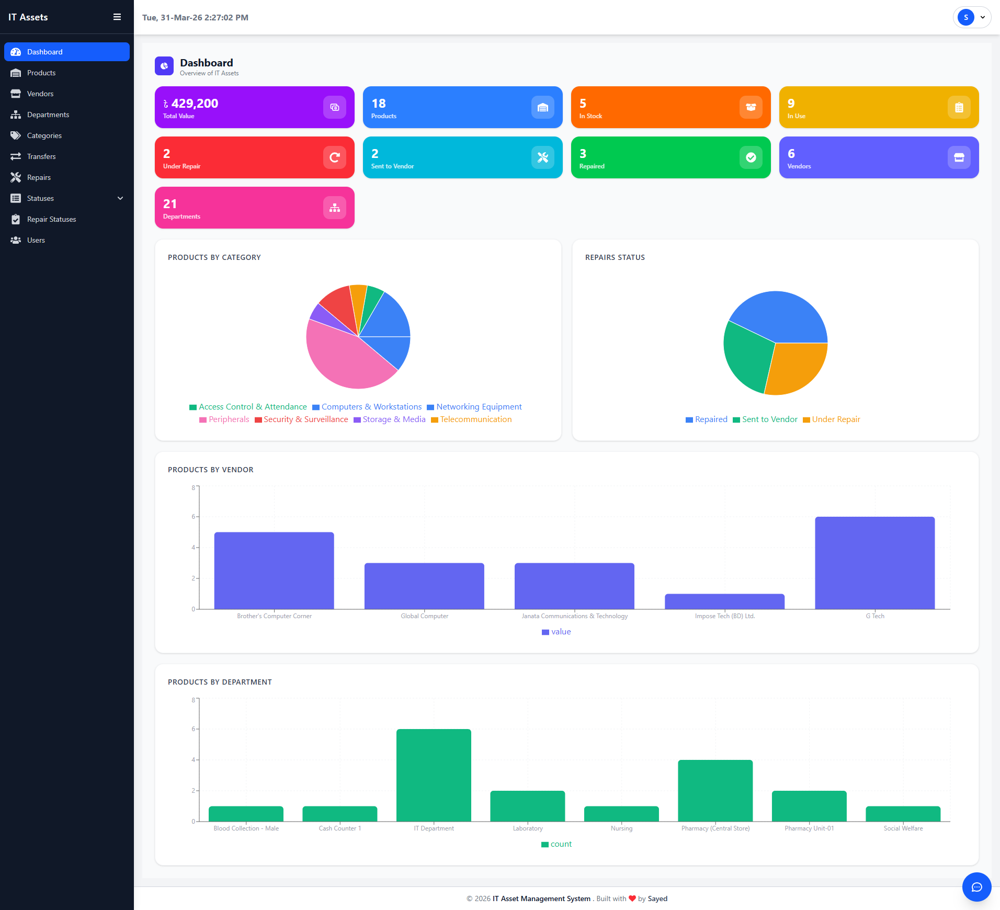 | 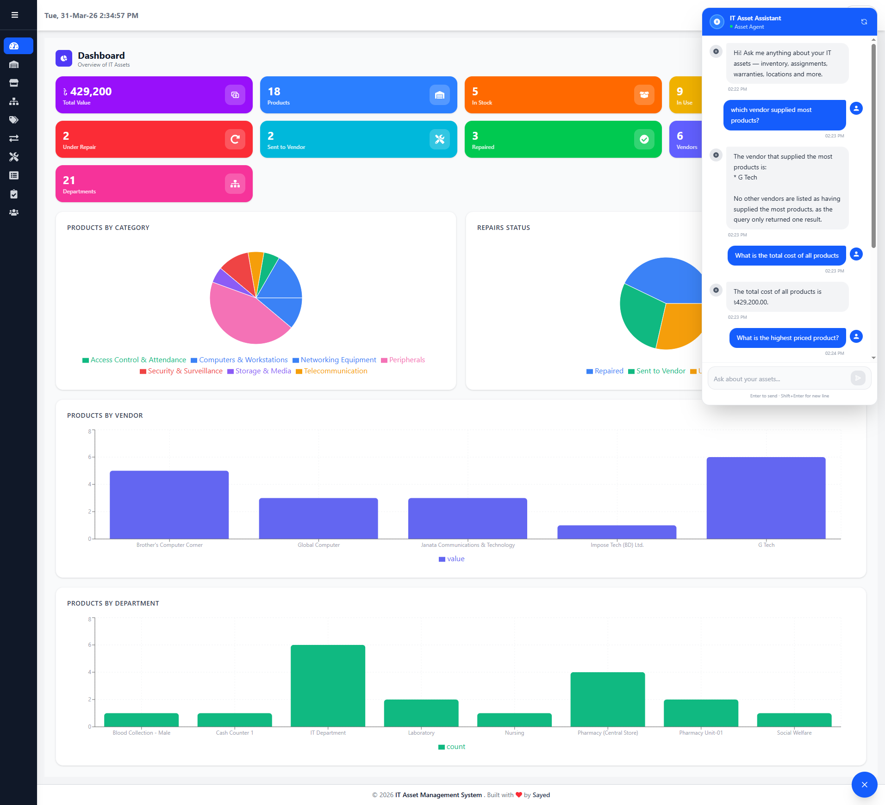 |

### Asset Management
| Product List | Add Product | Edit Product |
|--------------|-------------|--------------|
| 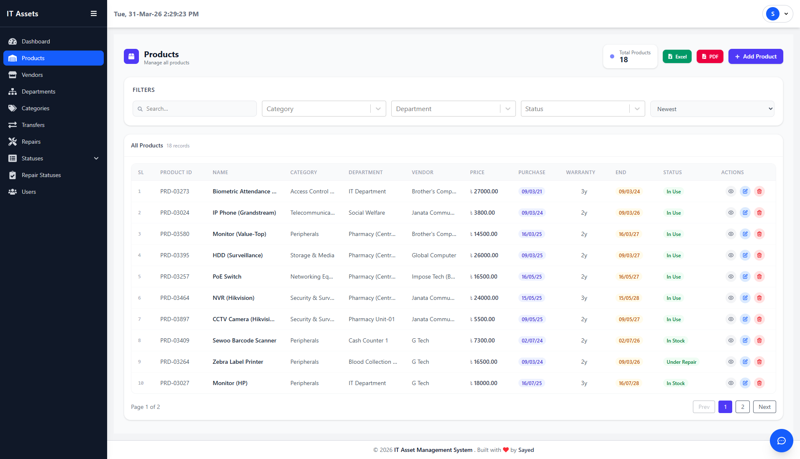 | 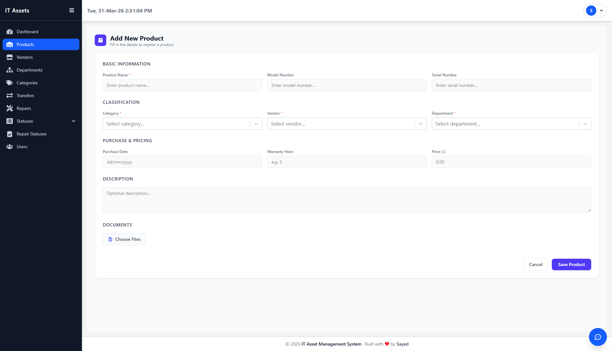 | 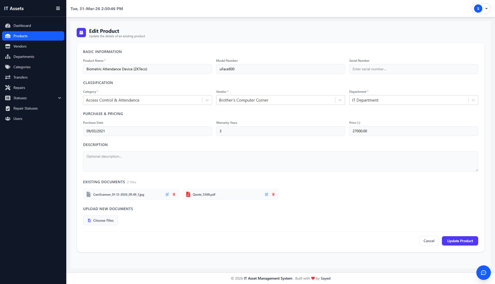 |

### Repair & Transfer
| Repair Management | Repair Status | Transfer |
|-------------------|---------------|----------|
| 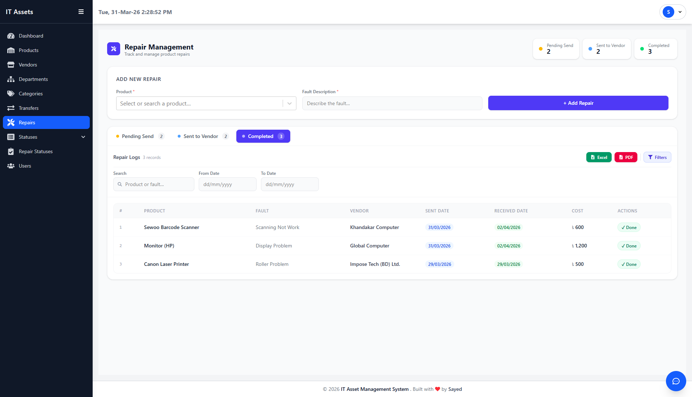 | 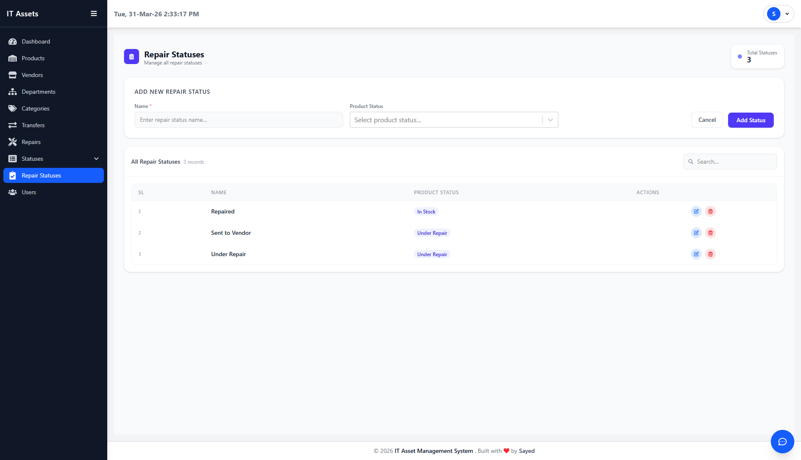 | 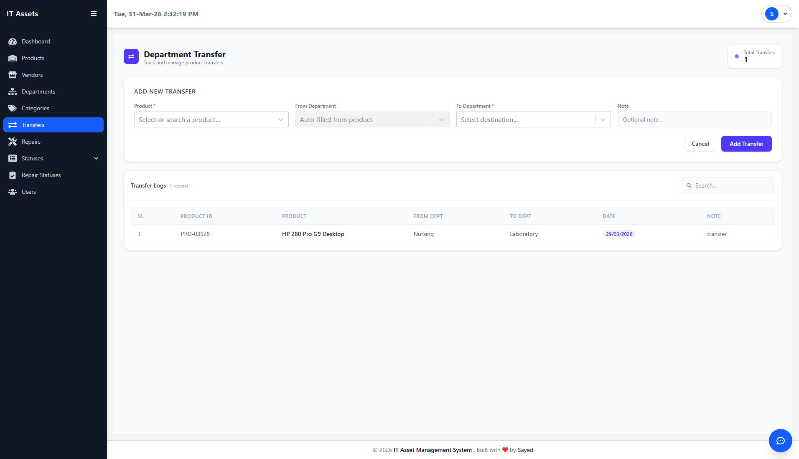 |

### Organization Management
| Vendors | Departments | Categories |
|---------|-------------|------------|
| 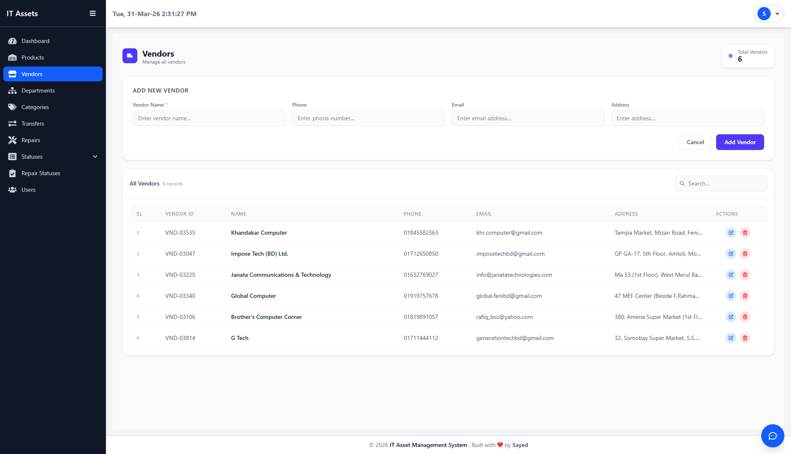 | 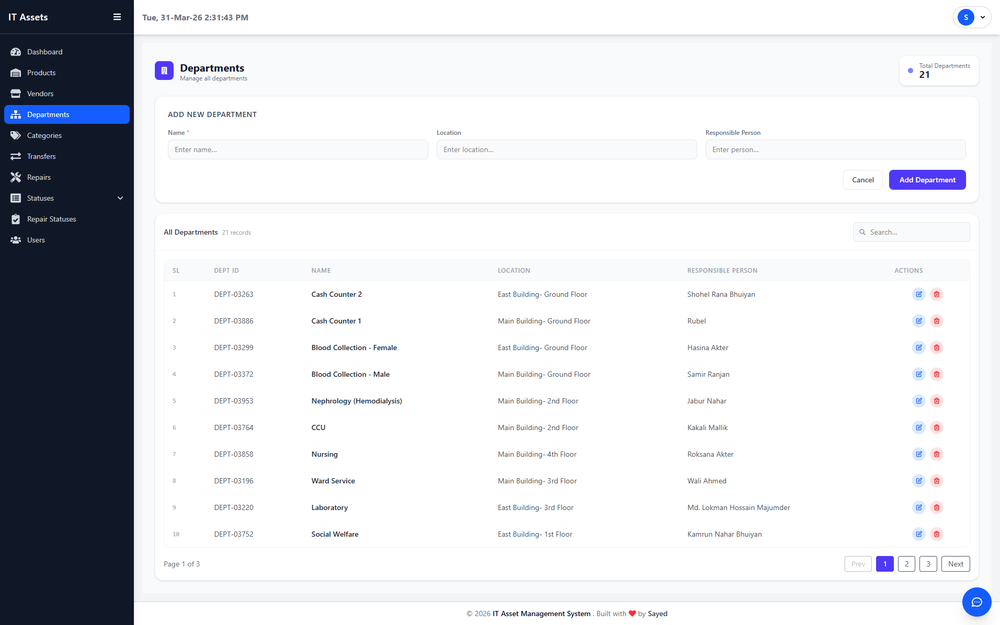 | 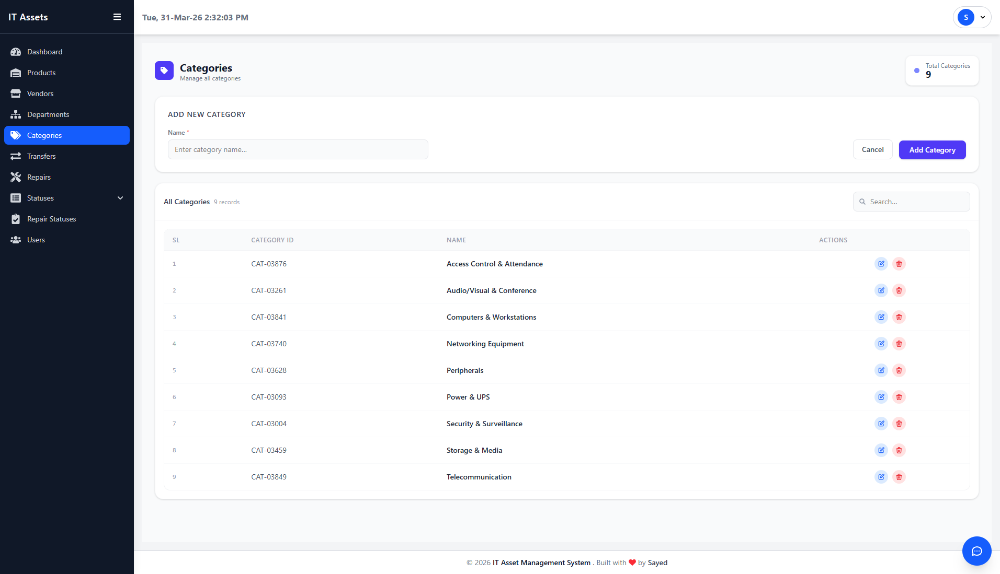 |

### Status & User Management
| Product Status | Change Status | Users | User Permissions |
|----------------|---------------|-------|------------------|
| 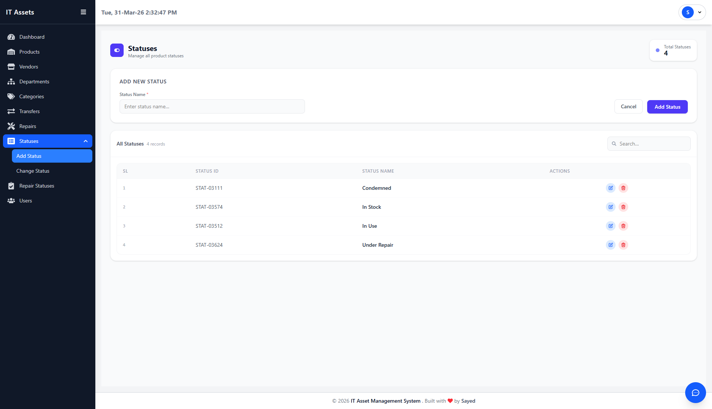 | 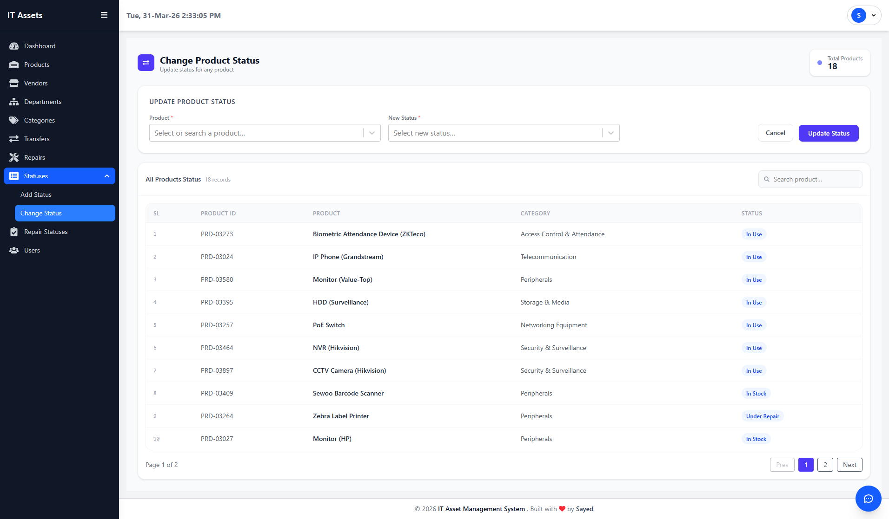 | 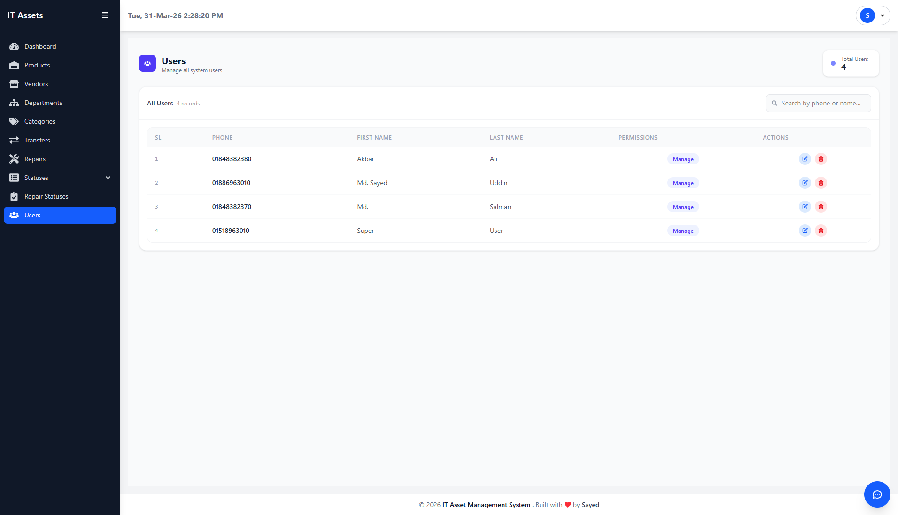 | 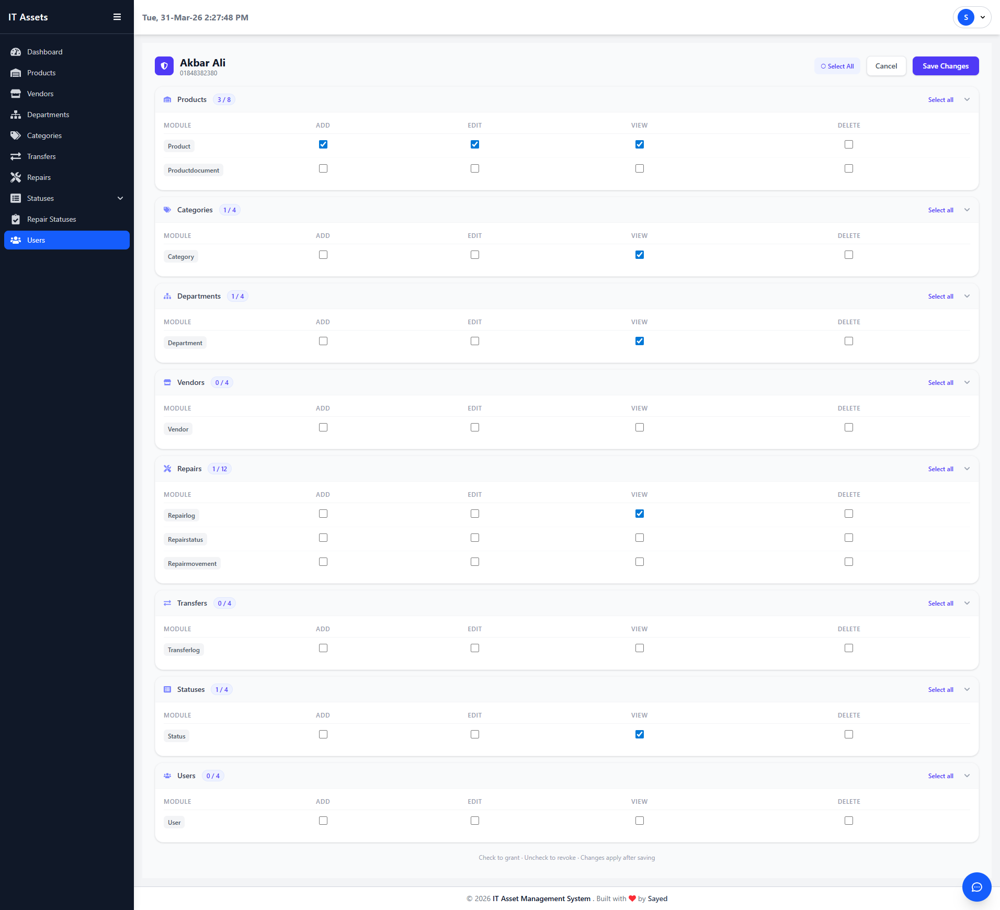 |

### Profile
| My Profile |
|------------|
| 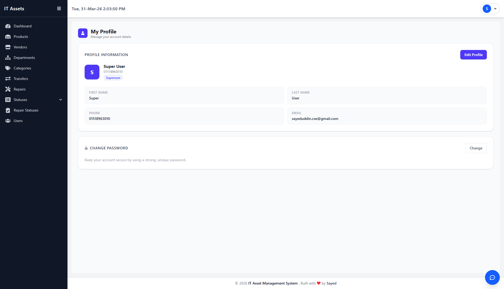 |

---

## ✨ Key Features

### 🗂️ Asset Tracking
- Register and track IT assets with full details: serial number, category, department, vendor, purchase date, warranty, and status.
- View complete asset history including assignments, transfers, and repairs.
- Filter and search assets by department, category, status, and more.

### 🔧 Repair Lifecycle Management
- Log repair requests with issue descriptions and priority levels.
- Track repair status: **Pending → In Progress → Resolved**.
- Full repair history per asset for audit and reporting.

### 🏢 Vendor Management
- Maintain a vendor directory with contact details and supply history.
- Link vendors to assets for warranty and support tracking.

### 🏷️ Department & Category Management
- Manage organizational departments and asset categories dynamically.
- Assign assets to departments with full transfer traceability.

### 🔄 Asset Transfer
- Initiate and track asset transfers between departments.
- Full transfer log with timestamps, source/destination, and approver details.

### 🔐 Granular Per-User Permission System
- Authorized users can assign **individual permissions to each user** — no predefined roles.
- Permissions are scoped **per menu** and **per action**: `view`, `add`, `edit`, `delete`.
- Each user's dashboard and available actions are dynamically rendered based on their assigned permissions.
- Example: User A may have `view` + `add` on Assets but only `view` on Vendors, while User B has full access to Repairs only.

| Permission Type | Description                        |
|-----------------|------------------------------------|
| **View**        | Can see the menu and read data     |
| **Add**         | Can create new records             |
| **Edit**        | Can modify existing records        |
| **Delete**      | Can remove records                 |

> Permissions are managed by any user who has been granted permission management access — making the system fully flexible without hardcoded roles.

### 🤖 Text-to-SQL AI Agent (Groq LLM)
- Query the entire database using **plain natural language** — no SQL knowledge required.
- Powered by **Groq LLM API** with ~2s average response time.
- Example queries:
  - *"How many assets are currently under repair in the IT department?"*
  - *"List all assets purchased before 2022 with expired warranties."*
  - *"Show vendor-wise asset count."*

### 🔑 OTP-Based Authentication
- Secure user registration and password reset via **OTP** sent through **Brevo** email integration.
- **JWT-based** stateless authentication for all API endpoints.

---

## 🛠️ Tech Stack

| Layer        | Technology                                          |
|--------------|-----------------------------------------------------|
| **Backend**  | Python, Django, Django REST Framework, Gunicorn     |
| **Frontend** | React.js, Tailwind CSS, Axios                       |
| **Database** | PostgreSQL                                          |
| **AI Agent** | Groq LLM API (Text-to-SQL)                          |
| **Email**    | Brevo SMTP (OTP / Password Reset)                   |
| **Auth**     | JWT (JSON Web Tokens)                               |
| **DevOps**   | Ubuntu VPS, Nginx, AAPanel                          |

---

## 🏗️ System Architecture

```
React Frontend (Port 3000)
        │
        ▼
   Nginx Reverse Proxy
        │
        ▼
Django REST API (Gunicorn)
        │
   ┌────┴────┐
   │         │
PostgreSQL  Groq LLM API
Database    (AI Agent)
```

---

## 📬 Contact

**Md. Sayed Uddin** — Full Stack Developer  
📧 [sayeduddin.cse@gmail.com](mailto:sayeduddin.cse@gmail.com)  
🔗 [LinkedIn](https://linkedin.com/in/sayeduddinn)  
🐙 [GitHub](https://github.com/SayedUddinRayhan)

---

> Built with ❤️ for [Feni Diabetes Hospital](https://fenidiabetic.org/) · Feni, Bangladesh
